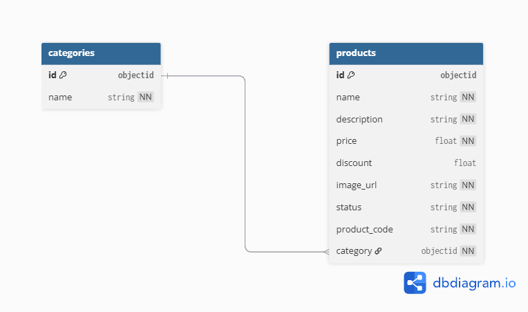

<a id="readme-top"></a>

<!-- PROJECT SHIELDS -->

[![Contributors][contributors-shield]][contributors-url]
[![Forks][forks-shield]][forks-url]
[![Stargazers][stars-shield]][stars-url]
[![Issues][issues-shield]][issues-url]
[![project_license][license-shield]][license-url]

<!-- PROJECT LOGO -->
<br />
<div align="center">
  <a href="https://github.com/BinaryBeast007/6s-backend">
    
  </a>

<h3 align="center">EcommerceAPI</h3>

  <p align="center">
    A backend API for managing products and categories in an e-commerce system, built with NestJS and MongoDB.
    <br />
    <a href="https://github.com/BinaryBeast007/6s-backend"><strong>Explore the docs »</strong></a>
    <br />
    <br />
    <a href="https://github.com/BinaryBeast007/6s-backend">View Demo</a>
    ·
    <a href="https://github.com/BinaryBeast007/6s-backend/issues/new?labels=bug&template=bug-report---.md">Report Bug</a>
    ·
    <a href="https://github.com/BinaryBeast007/6s-backend/issues/new?labels=enhancement&template=feature-request---.md">Request Feature</a>
  </p>
</div>

<!-- TABLE OF CONTENTS -->
<details>
  <summary>Table of Contents</summary>
  <ol>
    <li>
      <a href="#about-the-project">About The Project</a>
      <ul>
        <li><a href="#built-with">Built With</a></li>
      </ul>
    </li>
    <li>
      <a href="#getting-started">Getting Started</a>
      <ul>
        <li><a href="#prerequisites">Prerequisites</a></li>
        <li><a href="#installation">Installation</a></li>
      </ul>
    </li>
    <li><a href="#usage">Usage</a></li>
    <li><a href="#roadmap">Roadmap</a></li>
    <li><a href="#contributing">Contributing</a></li>
    <li><a href="#license">License</a></li>
  </ol>
</details>

<!-- ABOUT THE PROJECT -->

## About The Project

EcommerceAPI is a backend service designed for an e-commerce system, enabling the management of products and categories. It supports CRUD operations for products and categories, with features like unique product code generation, category validation, and price filtering with discounts. The application is built with a focus on scalability, security, and maintainability, using NestJS and MongoDB, and is fully containerized with Docker for easy deployment.

#### Database Diagram



<p align="right">(<a href="#readme-top">back to top</a>)</p>

### Built With

- [![NodeJS][NodeJS]][NodeJS-url]
- [![NestJS][NestJS]][NestJS-url]
- [![MongoDB][MongoDB]][MongoDB-url]
- [![Docker][Docker]][Docker-url]

<p align="right">(<a href="#readme-top">back to top</a>)</p>

<!-- GETTING STARTED -->

## Getting Started

To get a local copy of the project up and running, follow these steps. This guide will help you set up the environment for **EcommerceAPI** using Docker or a local development setup.

### Prerequisites

Before you begin, ensure you have the following installed:

- **Node.js** (Recommended version: >= 20.x LTS)
  - Install from: [Node.js][NodeJS-url]
- **npm** (Node package manager)
  - Verify with: `npm -v`
- **MongoDB** (for local development without Docker)
  - Install from: [MongoDB][MongoDB-url]

### Installation

#### Option 1: Dockerized Setup (Recommended)
1. Clone the repository:
   ```sh
   git clone https://github.com/BinaryBeast007/6s-backend.git
   ```
2. Navigate to the project directory:
   ```sh
   cd 6s-backend
   ```
3. Build and start the application and MongoDB using Docker Compose:
   ```sh
   docker-compose up --build
   ```
4. The application will be available at `http://localhost:3000`.
5. To stop the services:
   ```sh
   docker-compose down
   ```

#### Option 2: Local Development Setup
1. Clone the repository:
   ```sh
   git clone https://github.com/BinaryBeast007/6s-backend.git
   ```
2. Navigate to the project directory:
   ```sh
   cd 6s-backend
   ```
3. Install NPM packages:
   ```sh
   npm install
   ```
4. Set up environment variables: Create a .env file in the root directory of the project and add the following configuration:
   ```sh
   MONGO_URI=mongodb://mongo:27017/6s
   ```
   
6. Ensure MongoDB is running locally on `mongodb://localhost:27017/6s`.

7. Start the development server:
   ```sh
   npm run start:dev
   ```
8. The application will be available at `http://localhost:3000`.

<p align="right">(<a href="#readme-top">back to top</a>)</p>

<!-- USAGE EXAMPLES -->

## Usage

The **EcommerceAPI** provides endpoints for managing products and categories. Below are the primary endpoints:

- **Categories**:
  - `POST /categories`: Create a new category.
  - `GET /categories`: Retrieve all categories.
  - `GET /categories/:id`: Retrieve a category by ID.

- **Products**:
  - `POST /products`: Create a product with a valid category.
  - `PATCH /products/:id`: Update product details (description, discount, status).
  - `GET /products`: Retrieve products with optional filters (`?category=<category_name>&name=<search_term>`).
  - `GET /products/:id`: Retrieve a product by ID.

**Example Request** (Create a Product):
```bash
curl -X POST http://localhost:3000/products \
-H "Content-Type: application/json" \
-d '{ "name": "Wireless Mouse", "description": "A high-precision wireless mouse with ergonomic design.", "price": 29.99, "discount": 0, "image_url": "https://example.com/images/wireless-mouse.jpg", "status": "in_stock", "category": "electronics" }'
```

**Example Response**:
```json
{
  "_id": "507f191e810c19729de860ea",
  "name": "Wireless Mouse",
  "description": "A high-precision wireless mouse with ergonomic design.",
  "price": 29.99,
  "discount": 0,
  "image_url": "https://example.com/images/wireless-mouse.jpg",
  "status": "in_stock",
  "category": "electronics"
  "__v": 0
}
```


<p align="right">(<a href="#readme-top">back to top</a>)</p>

<!-- CONTRIBUTING -->

## Contributing

Contributions are welcome to enhance **EcommerceAPI**. To contribute:

1. Fork the Project.
2. Create your Feature Branch (`git checkout -b feat/AmazingFeature`).
3. Commit your Changes using Conventional Commits (`git commit -m 'feat: add AmazingFeature'`).
4. Push to the Branch (`git push origin feat/AmazingFeature`).
5. Open a Pull Request.

<p align="right">(<a href="#readme-top">back to top</a>)</p>

### Top contributors:

<a href="https://github.com/BinaryBeast007/6s-backend/graphs/contributors">
  
</a>

<p align="right">(<a href="#readme-top">back to top</a>)</p>

<!-- LICENSE -->

## License

Distributed under the MIT License. See [License][License-url] for more information.

<p align="right">(<a href="#readme-top">back to top</a>)</p>

<!-- MARKDOWN LINKS & IMAGES -->

[contributors-shield]: https://img.shields.io/github/contributors/BinaryBeast007/6s-backend.svg?style=for-the-badge
[contributors-url]: https://github.com/BinaryBeast007/6s-backend/graphs/contributors
[forks-shield]: https://img.shields.io/github/forks/BinaryBeast007/6s-backend.svg?style=for-the-badge
[forks-url]: https://github.com/BinaryBeast007/6s-backend/network/members
[stars-shield]: https://img.shields.io/github/stars/BinaryBeast007/6s-backend.svg?style=for-the-badge
[stars-url]: https://github.com/BinaryBeast007/6s-backend/stargazers
[issues-shield]: https://img.shields.io/github/issues/BinaryBeast007/6s-backend.svg?style=for-the-badge
[issues-url]: https://github.com/BinaryBeast007/6s-backend/issues
[license-shield]: https://img.shields.io/github/license/BinaryBeast007/6s-backend.svg?style=for-the-badge
[license-url]: https://github.com/BinaryBeast007/6s-backend/blob/main/LICENSE
[NodeJS-url]: https://nodejs.org/
[NodeJS]: https://img.shields.io/badge/node.js-6DA55F?style=for-the-badge&logo=node.js&logoColor=white
[NestJS-url]: https://nestjs.com/
[NestJS]: https://img.shields.io/badge/nestjs-%23E0234E.svg?style=for-the-badge&logo=nestjs&logoColor=white
[MongoDB-url]: https://www.mongodb.com/
[MongoDB]: https://img.shields.io/badge/MongoDB-%234ea94b.svg?style=for-the-badge&logo=mongodb&logoColor=white
[Docker-url]: https://www.docker.com/
[Docker]: https://img.shields.io/badge/docker-%230db7ed.svg?style=for-the-badge&logo=docker&logoColor=white
[License-url]: https://github.com/BinaryBeast007/6s-backend/blob/main/LICENSE